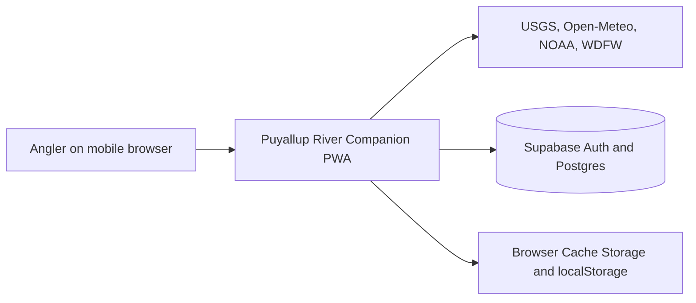
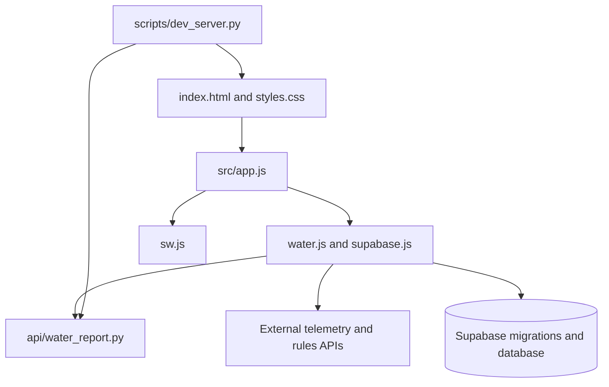
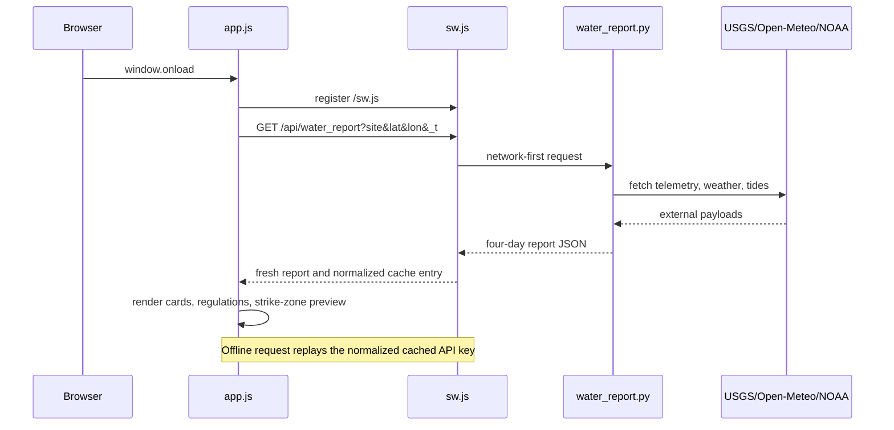
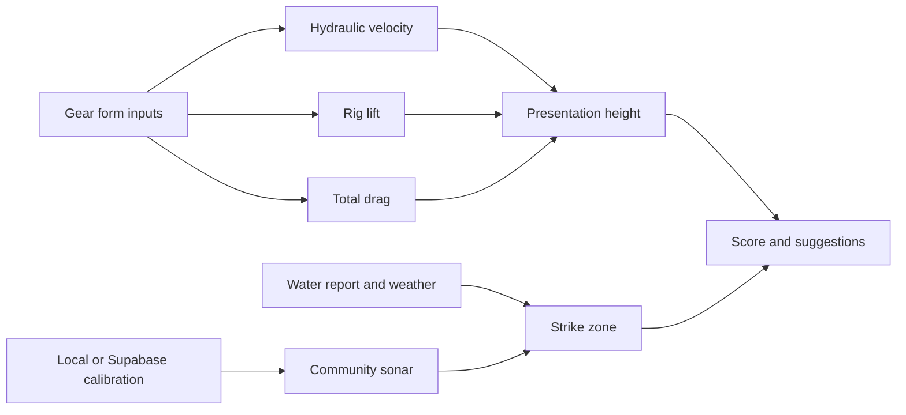

# Puyallup River Companion Architecture

## Snapshot

This document describes the local checkout at `origin/main`, branch `main`,
commit `6ce540f` (`Add repository AI agent guidance`), inspected on 2026-09-17.
The remote is `https://github.com/nickeprice/index.html.git`. No license file,
package manifest, lockfile, CI workflow, or existing architecture document was
found in the checkout.

The project is a mobile-first fishing companion for Washington rivers. It
combines a live water report, a deterministic gear simulator, and a private
catch log with a limited public feed. The product is an installable PWA and
has a cached application shell plus local fallbacks for unavailable services
([README.md](README.md#L1-L17)).

## Whole-Repository Deep Dive

### Stack

| Layer | Technology | Evidence |
| --- | --- | --- |
| UI | Static HTML and CSS | [index.html](index.html#L1-L13), [src/styles.css](src/styles.css) |
| Frontend runtime | Browser JavaScript, classic scripts, shared global scope | [README.md](README.md#L19-L42), [index.html](index.html#L264-L269) |
| PWA | Web app manifest and service worker | [manifest.json](manifest.json#L1-L47), [sw.js](sw.js#L1-L45) |
| Backend API | Python `BaseHTTPRequestHandler` | [api/water_report.py](api/water_report.py#L1-L10), [api/water_report.py](api/water_report.py#L227-L245) |
| Local server | Python `ThreadingHTTPServer` | [scripts/dev_server.py](scripts/dev_server.py#L15-L45) |
| Database/auth | Supabase JavaScript client, anonymous auth, Postgres | [src/services/supabase.js](src/services/supabase.js#L1-L58), [supabase/README.md](supabase/README.md) |
| Rules ingestion | Python `requests` plus BeautifulSoup scraper | [scripts/scrape_wdfw.py](scripts/scrape_wdfw.py#L1-L16) |

### Entry Points

- Browser entry: `index.html`. It defines the three tabs, forms, accessibility
  labels, and script tags. `src/app.js` is loaded last because it calls the
  services and registers `window.onload` ([index.html](index.html#L264-L274)).
- Service worker entry: `sw.js`, registered during the browser bootstrap in
  `src/app.js` ([src/app.js](src/app.js#L1665-L1716)).
- API entry: `api.water_report.handler.do_GET`; the same handler shape is used
  by the production serverless runtime and the local server
  ([api/water_report.py](api/water_report.py#L227-L245), [scripts/dev_server.py](scripts/dev_server.py#L30-L45)).
- Rules ingestion entry: `scripts/scrape_wdfw.py:scrape_wdfw`, which writes the
  JSON rules cache ([scripts/scrape_wdfw.py](scripts/scrape_wdfw.py#L171-L210)).
- Database entry: the two ordered SQL migrations under
  `supabase/migrations/`, documented in [supabase/README.md](supabase/README.md).

### Script Load Order

The dependency order is part of the runtime contract:

```text
Supabase CDN
  -> regulations.js
  -> riverRegulations.js
  -> services/supabase.js
  -> services/water.js
  -> app.js
```

The scripts are classic and intentionally share globals. A module conversion
would require a coordinated change to markup, exports, and every cross-file
reference; it is not a local syntax change.

### Commands and Verification Inventory

| Command | Purpose | Status/evidence |
| --- | --- | --- |
| `find src -name '*.js' -print0 \| xargs -0 -n1 node --check` | JavaScript syntax | Canonical check in [AGENTS.md](AGENTS.md#L31-L38); verified in this snapshot |
| `node --check sw.js` | Service-worker syntax | Canonical check in [AGENTS.md](AGENTS.md#L31-L38); verified in this snapshot |
| `python3 -m py_compile api/water_report.py scripts/dev_server.py scripts/scrape_wdfw.py` | Python syntax | Canonical check in [AGENTS.md](AGENTS.md#L42-L46); verified in this snapshot |
| `python3 scripts/dev_server.py 8000` | Serve the static app and delegate `/api/*` locally | [README.md](README.md#L85-L105), [scripts/dev_server.py](scripts/dev_server.py#L68-L89) |
| Browser smoke/Playwright pass | Page errors, accessibility names, service-worker caches, offline replay, deep links, debounce, toasts, tabs, and empty states | Described in [README.md](README.md#L111-L129); runner/configuration is not committed [UNVERIFIED] |
| `npx supabase login`, `npx supabase link`, `npx supabase db push` | Apply hosted migrations | [supabase/README.md](supabase/README.md); requires interactive/authenticated CLI [UNVERIFIED locally] |
| `npx supabase start`, `npx supabase db reset` | Build a local Supabase stack | [supabase/README.md](supabase/README.md); requires Docker [UNVERIFIED locally] |
| Scraper invocation | Refresh `src/data/wdfw_rules.json` | Script exists, but its CLI tail and dependency installation contract are not documented [UNVERIFIED] |

There is no committed build, lint, formatter, typecheck, test runner, or CI
workflow. CI enforcement and branch protection are [UNVERIFIED].

### Directory Layout

| Path | Purpose |
| --- | --- |
| `index.html` | Product shell, forms, tabs, script loading |
| `src/` | Browser application code and static data |
| `src/app.js` | State, navigation, auth flow, report rendering, Gear Sim, catch log, bootstrap |
| `src/services/` | Network/database service layers |
| `src/utils/` | Regulation and solar calculations |
| `src/data/` | Seed regulations and scraped WDFW rules |
| `api/` | Production-shaped Python water-report endpoint |
| `scripts/` | Local server and WDFW scraper |
| `supabase/migrations/` | Idempotent Postgres schema and RLS migrations |
| `icons/` | PWA icon assets |
| `.github/` | Present but no workflows were found in the checkout |

### Runtime and Deployment Surface

| Runtime surface | Evidence | Confidence |
| --- | --- | --- |
| Browser runtime | PWA manifest and classic browser scripts | High |
| Python runtime | Python 3 syntax and standard-library HTTP server; exact supported version absent | [UNVERIFIED] |
| Serverless deployment | README describes the Python handler as Vercel-shaped and says no `vercel.json` is required | High for intended shape; actual deployment [UNVERIFIED] |
| Supabase Postgres | Supabase README identifies Postgres 17.x and project ref | High for documented backend; hosted runtime enforcement [UNVERIFIED] |
| Local database | `supabase start` requires Docker | Documented; image/runtime pins [UNVERIFIED] |
| Node runtime | Used only for `node --check` validation; no `.nvmrc`, `package.json`, or engine declaration found | [UNVERIFIED] |

No container image, runtime file, lockfile, CI runner pin, or deployment
configuration was found. There is no reliable local basis for an EOL dependency
scan; the external Supabase CDN dependency is major-version-floating (`@2`)
and should be treated as [UNVERIFIED] for reproducibility.

## Context and Ecosystem

### Repository Guidance

- [AGENTS.md](AGENTS.md) defines the architecture boundaries, privacy rules,
  validation commands, and data-source expectations.
- [copilot-instructions.md](copilot-instructions.md) is the shorter Copilot
  checklist for classic scripts, offline behavior, RLS, and validation.
- [.clinerules](.clinerules) defines a plan/act workflow. Planning work creates
  `TASK.md`; act mode advances it sequentially and runs each verification step.
- [README.md](README.md) is the product and operational overview.

### External Services Visible from Disk

The system directly integrates with USGS NWIS, Open-Meteo, NOAA tides, WDFW
Socrata, WDFW eRegulations, Supabase, and the Supabase JavaScript CDN. Their
URLs and roles are visible in [src/services/water.js](src/services/water.js#L1-L18),
[api/water_report.py](api/water_report.py#L35-L154),
[src/services/supabase.js](src/services/supabase.js#L1-L16), and
[scripts/scrape_wdfw.py](scripts/scrape_wdfw.py#L1-L16). No sibling repository or
separately deployed local service is referenced.

## Architectural Blueprint

### System Context



### Containers



### Water Report Lifecycle



### Layering Rules

1. `index.html` supplies markup and load order; it should not become a second
   application controller.
2. `src/app.js` owns orchestration and DOM state. Services should expose data or
   small transforms rather than silently changing unrelated UI state.
3. `src/services/water.js` owns browser-side telemetry reads; the Python API
   owns the aggregate four-day report.
4. `src/services/supabase.js` is the only browser-facing database/auth adapter.
5. `sw.js` owns network interception and cache policy; application code owns
   user-visible update approval.
6. SQL migrations are the database source of truth. Changes must preserve RLS
   and the public/private column boundary.

These rules are conventions enforced by file structure and review, not by a
compiler or CI gate.

### Cross-Cutting Concerns

| Concern | Implementation | Evidence |
| --- | --- | --- |
| Auth | Supabase anonymous sessions with cached display name; local-only fallback | [src/services/supabase.js](src/services/supabase.js#L61-L122) |
| Authorization | RLS on private catches; public feed view; security-definer calibration RPC | [supabase/migrations/20260917000000_init_schema.sql](supabase/migrations/20260917000000_init_schema.sql#L39-L111), [supabase/migrations/20260917000100_normalize_rls.sql](supabase/migrations/20260917000100_normalize_rls.sql#L38-L71) |
| Configuration | Constants in client/API files; publishable Supabase key in browser | [src/services/supabase.js](src/services/supabase.js#L16-L24), [api/water_report.py](api/water_report.py#L9-L15) |
| Logging | `logDebug` writes to the in-app debug console | [src/app.js](src/app.js#L11-L28) |
| Error handling | Network reads swallow errors and render placeholders/empty states | [src/services/water.js](src/services/water.js#L25-L34), [src/app.js](src/app.js#L520-L560) |
| Offline state | Service-worker caches, localStorage catch buffer, local solar fallback | [sw.js](sw.js#L1-L26), [src/app.js](src/app.js#L1730-L1781) |
| Observability | Debug UI only; no metrics or tracing integration found | [UNVERIFIED] beyond local code |
| Feature flags | No feature-flag system found; station/data maps act as static capability maps | [UNVERIFIED] |

## Significant Subsystems

### 1. Water Report and Regulations

`loadWaterReport()` restores or initializes the active station, starts rules and
water-report work concurrently, renders four forecast days, then launches
independent telemetry reads ([src/app.js](src/app.js#L540-L560), [src/app.js](src/app.js#L640-L695)).
The Python endpoint independently fans out to USGS, Open-Meteo, and NOAA, then
calculates flow state, escapement/stock timing, tide arrivals, and minute-level
fishing windows ([api/water_report.py](api/water_report.py#L227-L320)).

The regulation engine combines date, river identity, and optional GPS. It loads
the scraped JSON cache in the browser and evaluates zone bounding boxes and
rules ([src/utils/regulations.js](src/utils/regulations.js#L1-L16), [src/utils/regulations.js](src/utils/regulations.js#L76-L120)).
If remote rules or telemetry fail, legal-hour and empty-state fallbacks keep the
screen usable.

### 2. Deterministic Gear Sim and Community Sonar

The simulator is a pure calculation pipeline inside `app.js`: inputs become
hydraulic velocity, rig lift, total drag, presentation height, strike-zone
adjustments, and a score. The drag coefficient is fixed at `1.0`; community
catch data shifts the fish-holding zone rather than changing physics
([src/app.js](src/app.js#L680-L720), [src/app.js](src/app.js#L910-L1030)).

`runSim()` reads the form, fetches anonymized calibration data, falls back to
local catches, solves the rig, and writes `currentStats` for the catch log
([src/app.js](src/app.js#L1190-L1325)). Numeric controls use a trailing debounce
for preview updates ([src/app.js](src/app.js#L1600-L1628)).



### 3. Offline Persistence and Privacy Boundary

`logData()` writes the full catch payload to localStorage before attempting the
Supabase write. Failed writes receive `pendingSync` and are retried when a
session becomes available ([src/app.js](src/app.js#L1340-L1415), [src/app.js](src/app.js#L220-L253)).
The Supabase adapter maps the local payload to private database columns and
returns only the inserted ID ([src/services/supabase.js](src/services/supabase.js#L124-L181)).

The SQL view exposes name, time, flow, and fish; GPS and tackle fields remain in
`public.catches`. RLS policies restrict direct rows to the owning auth user,
while the calibration RPC returns anonymized tackle fields for the simulator
([supabase/migrations/20260917000000_init_schema.sql](supabase/migrations/20260917000000_init_schema.sql#L39-L111), [supabase/migrations/20260917000100_normalize_rls.sql](supabase/migrations/20260917000100_normalize_rls.sql#L38-L71)).

### 4. Service Worker and Update Lifecycle

The worker precaches the shell, caches the Supabase CDN separately, normalizes
the water-report cache key by removing `_t`, and deletes old cache versions on
activation ([sw.js](sw.js#L29-L128)). Navigation and the water-report endpoint
are network-first; same-origin assets are stale-while-revalidate; third-party
telemetry remains network-only ([sw.js](sw.js#L130-L210)). Updates wait for
explicit user approval so an in-progress catch form is not discarded
([src/app.js](src/app.js#L1665-L1716)).

## How to Add a Feature

1. Identify the owning boundary: markup, orchestration, browser service, API,
   worker, regulation data, or migration.
2. Read the neighboring implementation and any duplicated controls before
   editing. Keep classic globals and script order intact.
3. Preserve the offline path and explicit empty states for every network-backed
   feature.
4. For catch or calibration data, decide whether the field is private, public,
   or anonymized before changing the client mapper, view, RPC, or migration.
5. For service-worker changes, reason about install, activate, online refresh,
   offline replay, and version invalidation together.
6. Run syntax checks, then the affected browser/API smoke path. Update README or
   migration documentation when operational behavior changes.

Common pitfalls include adding a script after `app.js`, changing only one copy
of a synchronized form field, caching live third-party telemetry, exposing a
private column through the public view, and treating Supabase failure as a
reason to discard a locally buffered catch.

## Confidence Assessment

| Claim area | Confidence | Notes |
| --- | --- | --- |
| Frontend structure and script order | High | Directly visible in `index.html` and README |
| Gear Sim data flow | High | Directly visible in `src/app.js` |
| Service-worker cache policy | High | Directly visible in `sw.js` |
| Supabase privacy model | High | Directly visible in migrations and service adapter |
| Local development command | High | README and `scripts/dev_server.py` agree |
| Production deployment provider | Inferred | README describes a Vercel-shaped handler, but no deployment config exists |
| Exact Python/Node supported versions | Unverified | No runtime declarations found |
| Browser test runner and CI enforcement | Unverified | README describes a Playwright pass, but no runner/workflow is committed |
| Current external API availability and data freshness | Unverified | Runtime-dependent and not measured by this document |

## Footnotes: Key Local Evidence

- [README.md](README.md): product scope, architecture, data flow, PWA behavior, local development, and testing claims.
- [index.html](index.html): browser markup, form boundaries, and script load order.
- [src/app.js](src/app.js): application orchestration, state, simulator, catch persistence, and bootstrap.
- [src/services/water.js](src/services/water.js): browser-side telemetry and WDFW escapement integration.
- [src/services/supabase.js](src/services/supabase.js): auth, payload mapping, feed, and calibration adapter.
- [src/utils/regulations.js](src/utils/regulations.js): GPS-aware regulations and local fallback calculations.
- [api/water_report.py](api/water_report.py): external aggregation and forecast computation.
- [sw.js](sw.js): offline shell, API cache normalization, and update semantics.
- [scripts/dev_server.py](scripts/dev_server.py): integrated local runtime.
- [scripts/scrape_wdfw.py](scripts/scrape_wdfw.py): WDFW rules ingestion.
- [supabase/migrations/20260917000000_init_schema.sql](supabase/migrations/20260917000000_init_schema.sql): schema, view, grants, and calibration RPC.
- [supabase/migrations/20260917000100_normalize_rls.sql](supabase/migrations/20260917000100_normalize_rls.sql): canonical private-row RLS policies.